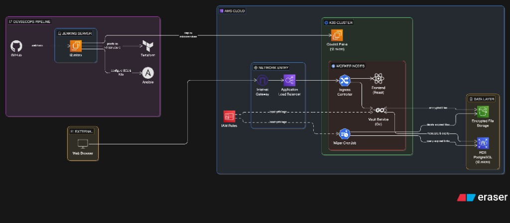

# irminsul - zero-trust ephemeral secure file drop

irminsul is a microservices-based platform engineered for highly secure and strictly temporary transfer of sensitive payloads
payloads undergo client-side encryption before network transmission, receive strict time-to-live or single-use constraints, and are cryptographically purged from object storage upon constraint fulfillment
the infrastructure stack is deployed to amazon web services via a fully automated devsecops pipeline

> "Changing the information in Irminsul changes Teyvat. But Irminsul can't change information that was well hidden in advance."

## architecture 



* frontend application handles in-browser payload encryption using aes-256-gcm with a key derived via pbkdf2 and 300,000 iterations
* plaintext bytes never leave the client environment
* vault service generates single-use ephemeral presigned s3 urls and persists only file metadata (identifier, sha256 hash, size, time-to-live, remaining downloads) within the postgres database
* wiper service executes as a kubernetes cronjob on a five-minute interval to issue hard-deletes for objects exceeding their time-to-live or download budget
* infrastructure is provisioned using terraform on amazon web services, encompassing virtual private clouds, t3.micro ec2 instances, rds postgres, and s3 with server-side encryption and lifecycle backstops
* kubernetes orchestration is handled by k3s to maintain free-tier compatibility on ec2 instances, as eks is explicitly avoided
* continuous integration runs on jenkins long-term support with sequential stages for linting, static analysis (gosec, semgrep, trivy), testing, building, image scanning, elastic container registry push, and kubectl apply operations

refer to `docs/architecture.md` for the comprehensive nist sp 800-207 zero-trust mapping and system threat model

## repository layout

```text
.
├── docs/                architecture specifications, aws bootstrap routines, runbooks, infrastructure diagrams
├── infra/
│   ├── terraform/       aws resources (virtual private cloud, ec2 compute, rds databases, s3 storage, iam roles, load balancers)
│   └── ansible/         operating system hardening protocols, k3s bootstrapping, jenkins configuration
├── services/
│   ├── vault/           go-based rest application programming interface
│   ├── wiper/           go-based cronjob executable
│   └── frontend/        react client utilizing vite and typescript
├── deploy/k8s/          kubernetes namespaces, deployment manifests, service definitions, network policies, ingress routes
└── ci/
    ├── Jenkinsfile      declarative pipeline definition
    └── jenkins/casc.yaml jenkins configuration-as-code state
```

## demonstration and verification scripts

the repository includes bash scripts to quickly validate system security and operational functionality

* `./up.sh` / `./down.sh` automate the start and stop operations for all ec2 instances to manage compute costs while preserving k3s cluster state
* `./test_api.sh` executes a complete command-line upload flow (initialization, url presigning, and direct put) to validate backend api health
* `./show_storage.sh` retrieves s3 object lists and dumps hexadecimal output of the latest blob to verify at-rest encryption properties
* `./check_system.sh` polls kubernetes pod status metrics and streams real-time log outputs from the vault service

## quickstart deployment

```bash
# 1. provision amazon web services infrastructure
cd infra/terraform
terraform init && terraform apply

# 2. configure operating systems and k3s orchestration
cd ../ansible
ansible-playbook -i inventory.ini playbooks/site.yml

# 3. deploy application services via kubectl
cd ../../deploy/k8s
kubectl apply -f .

# 4. execute verification test suite
./test_api.sh
./show_storage.sh
```

## security and architecture implementation notes

### client-side encryption fallback mechanisms
the native web crypto api (`crypto.subtle`) is standard but browsers disable it on insecure http origins
for development environments routing through a public load balancer without an active acm certificate, irminsul implements a transparent cryptographic polyfill utilizing `@noble/ciphers` and `@noble/hashes`
this fallback ensures aes-256-gcm operations execute successfully in-browser even over standard http connections

### zero-trust storage constraints
the backend vault service remains entirely isolated from the decryption passphrase
it functions strictly as a secure routing layer to dispense s3 presigned urls
malicious actors with root access to the aws account cannot decrypt storage payloads without obtaining the out-of-band passphrase

### automated cleanup routines
the wiper service queries the postgres instance for expired records every five minutes
it issues delete operations directly to the s3 bucket and subsequently scrubs all database metadata to guarantee ephemeral constraints are strictly enforced

### stride threat model

to ensure robust security, irminsul was evaluated using the stride-lite threat model. refer to `docs/architecture.md` for full details.

| threat | example scenario | mitigation |
| --- | --- | --- |
| **spoofing** | attacker spoofs vault service to the frontend | strict tls enforcement at application load balancer and ingress; kubernetes network policies restrict frontend pod ingress to the ingress namespace. |
| **tampering** | attacker mutates ciphertext in-flight or in s3 | aes-gcm provides authenticated encryption (aead); tampering results in immediate decryption failure on the client. s3 versioning and lifecycle policies protect against non-current version tampering. |
| **repudiation** | user repudiates uploading a file | `access_log` table in postgres logs `upload_init` and `download` events with ip and user-agent. kubernetes audit logs track api server interactions. |
| **information disclosure** | server remote code execution (rce) leaks plaintext | plaintext never leaves the user agent. vault only handles metadata and ciphertext length. presigned urls expire quickly (~5m). |
| **denial of service** | attacker exhausts s3 storage or rds connections | alb rate limiting, per-upload size caps, and file count limits per ip via postgres. |
| **elevation of privilege** | vault pod attempts unauthorized `s3:deleteobject` | strict iam policies scoped per-workload (vault role has put/get only, wiper role has del/list only). network policies block pod-to-pod lateral movement. |

## environment teardown

```bash
cd infra/terraform
terraform destroy
```

if the destroy operation throws errors regarding non-empty s3 buckets, execute `aws s3 rm s3://<bucket> --recursive` prior to tearing down the state
