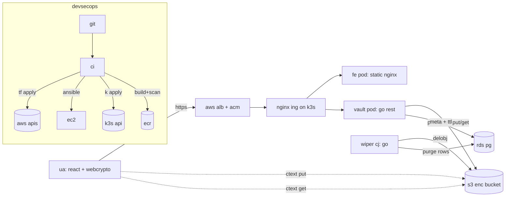

# irminsul arch

docs:
1. sys overview & data flow
2. threat model (stride-lite)
3. nist sp 800-207 zt arch mapping

## 1. sys overview

### up flow

1. usr selects file in react ui & inputs pwd
2. ua derives 256b aes-gcm key via pbkdf2(sha-256, 300k), gens 16b salt & 12b iv, enc file
3. json meta hdr (fn, mime) prepended to ctext for dl side restoration
4. ua req `post /api/v1/uploads` w/ `{size, ttl, max_downloads}`
   vault txns row in pg & acks presigned s3 put url + 256b share token
5. ua puts ctext dir to s3
6. ua builds url `https://<host>/d/<token>#<salt>.<iv>` & outputs to usr
   frag after `#` never leaves ua, hiding salt/iv from be/proxy

### dl flow

1. rx opens `https://<host>/d/<token>#<salt>.<iv>`
2. ua req `get /api/v1/downloads/{token}`
   vault init serializable txn, atomic dec `remaining_downloads`, acks short-lived presigned get url (or 410 gone)
3. ua dl ctext from s3
4. rx inputs pwd; ua derives key, dec w/ aes-gcm(iv), inits dl via restored fn/mime

### wipe flow

1. k8s cj `wiper` execs `*/5 * * * *`
2. wiper init serializable txn, `select ... for update skip locked` batch where `expires_at <= now()` or `remaining_downloads <= 0`, req `s3:deleteobject`, drops rows
3. s3 hard 7d lc rule acts as fallback if wiper unavail

## 2. threat model (stride-lite)

| threat | ex | mit |
| --- | --- | --- |
| **sp** | atk spoofs vault to fe | tls @ alb, ing, s3 netpols restrict fe pod ingress to ing ns |
| **tm** | atk mutates ctext in-flight/s3 | aes-gcm is aead; tamper fails dec on rx s3 ver + lc exp on noncurrent vers |
| **rp** | usr repuds up | `access_log` tbl in pg logs `upload_init`/`download` w/ ip+ua k8s audit logs on api svr |
| **id** | svr rce leaks ptext | ptext never leaves ua vault only sees meta + ctext len presigned urls exp ~5m |
| **dos** | atk exhausts s3/rds | alb rl (tbd), per-up size cap (100mb demo), file cnt per ip via pg ft bounded by design |
| **pe** | vault pod req `s3:deleteobject` | iam pols scoped per-wkld (`vault-role` put/get only, `wiper-role` del/list only) netpols drop pod-to-pod lateral mvmt |

### non-goals / gaps

- no sso for up demo uses shared hs256 jwt sec prod should plug oidc (cognito/okta/aad) via istio/auth proxy
- no e2e int check on pwd: bad pwd fails *dec* but svr cant diff "bad pwd" vs "tampered ctext" due to gcm
- wiper lat up to 5m post ttl exp s3 lc is fallback (1d eval)
- on k3s, iam4pods approx'd via node ip prod -> eks pod id or kube-workload-identity

## 3. nist sp 800-207 zta map

nist 7 tenets of zt map to irminsul ctrls

| # | tenet | irminsul impl |
| - | --- | --- |
| 1 | all ds & svc are res | files (s3 objs), meta (rds rows), wklds (k8s pods), infra (ec2 insts) treated as 1st-class res w/ own+tags+iam |
| 2 | all comm sec rx of loc | tls on alb (acm), ua->s3, vault/wiper->rds (`sslmode=require`), k8s api svr, kubelet |
| 3 | acc to res is per-sess | ups gen rnd share token dls atomic dec cnt & gen *new* presigned get url (ttl ~2m) up jwts short-lived |
| 4 | acc det by dyn pol | ttl + rem-dl cntrs eval'd per-req netpols match pod lbls iam pols scoped per-wkld |
| 5 | ent mons & meas int & sec posture | `access_log` tbl + k8s audit + alb logs + trivy img scans + semgrep sast archived by ci |
| 6 | res auth/authz dyn & enf b4 acc | hs256 jwt on `/uploads` 256b share tokens on `/downloads` iam eval on every s3 api req netpols enf pod i/e |
| 7 | ent collects info on state to imp sec posture | rds audit tbl, k8s audit, zerolog json from be, sast+img scans, tf state as ssot |

### pillar cov (cisa ztmm)

| pillar | ctrl |
| --- | --- |
| **id** | dep iam usr w/ mfa jwt + share token for usrs per-wkld iam roles |
| **dev** | n/a (h2m drop) but psa `restricted` prof drops priv pods |
| **net** | vpc w/ pub/priv split, sg per wkld, k8s netpols def-deny, e2e tls |
| **app** | distroless ctrs, non-root, ro rootfs, seccomp `runtimedefault`, drop-all caps |
| **data** | aes-256-gcm ua-side, sse-s3, enc rds, ttl+wipe fallback |

## appx a: img inv

| img | base | runs as |
| --- | --- | --- |
| `irminsul/vault` | `gcr.io/distroless/static-debian12:nonroot` | uid 65532 |
| `irminsul/wiper` | `gcr.io/distroless/static-debian12:nonroot` | uid 65532 |
| `irminsul/frontend` | `nginxinc/nginx-unprivileged:1.27-alpine` | uid 101 |

imgs built by ci via pinned base tags, trivy scanned, pushed to priv ecr w/ `image_tag_mutability = immutable`
k8s manifests ref git-sha tag (no `:latest` in prod)

## appx b: aws res inv

ref `infra/terraform/outputs.tf`

- vpc + 2 pub + 2 priv subnets (2 azs)
- 3-5 ec2 `t3.micro` (ci + k3s svr + 1-3 agts)
- rds `db.t3.micro` pg 16
- s3 bucket: sse-s3, block-pub, ver, lc 7d exp
- alb: inet-facing, waf opt (def off)
- 3 iam roles: `vault`, `wiper`, `jenkins` + 1 `k3s_agent` inst prof
- 3 ecr repos: imm tags, scan-on-push
